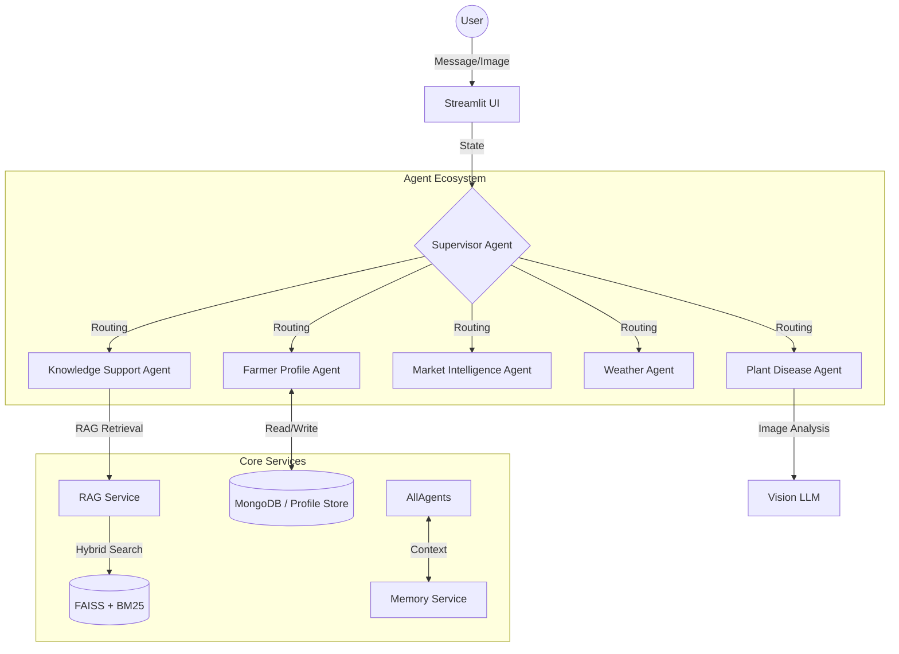

# Farm-AI: Intelligent Agricultural Assistant 👨‍🌾


## 📖 Overview

**Farm-AI** is a cutting-edge, multi-agent artificial intelligence system designed to assist farmers with daily agricultural tasks. It leverages modern LLMs (Language Models) and RAG (Retrieval-Augmented Generation) to provide personalized advice, market intelligence, weather forecasts, and plant disease diagnosis.

The system is built on a modular **LangGraph** architecture, orchestrating specialized agents that share a unified memory of the farmer's profile, crops, and past activities.

## 🏗️ Architecture

The system uses a **Supervisor-Worker** pattern. A central `Supervisor` agent analyzes user input and routes it to the most appropriate specialist agent. All agents share context via a centralized `MemoryService`.



### 🧩 Core Agents

| Agent | Responsibility |
|-------|----------------|
| **Supervisor** | The brain of the operation. Decides which agent handles the request based on strict routing rules and conversation context. |
| **Knowledge Support** | The generalist. Uses **Hybrid RAG** (Semantic + Keyword) to answer farming questions from verified manuals. Also logs completed activities (e.g., "I watered the plants"). |
| **Market Intelligence** | Fetches real-time market prices, subsidies, and government scheme information. |
| **Plant Disease** | Visual diagnosis specialist. Analyzes uploaded plant images to identify diseases and recommend treatments. |
| **Farmer Profile** | Manages the user's digital twin: location, cultivated crops, and soil details. |
| **Weather** | Provides hyper-local weather forecasts and advisory. |

---

## 🚀 Key Features

### 1. Robust RAG (Retrieval-Augmented Generation)
- **Hybrid Search**: Combines **FAISS** (Dense Vector Search) and **BM25** (Sparse Keyword Search) using **Reciprocal Rank Fusion (RRF)** for optimal retrieval accuracy.
- **Persistence**: Knowledge base is indexed and persisted locally, allowing for fast reloads and offline capabilities.
- **Evaluation**: Built-in evaluation pipeline to measure **Precision@K**, **Recall@K**, and **MRR** (Mean Reciprocal Rank).

### 2. Multi-Modal Interaction
- Support for **Text** and **Image** inputs.
- Users can upload photos of sick plants for instant diagnosis.

### 3. Context-Aware Memory
- "Remembering" the user's crops and location across sessions.
- Logs farming activities (e.g., sowing, harvesting) to track crop lifecycle.

### 4. MCP Server Integration (Model Context Protocol)
- **Extensibility**: Uses the **Model Context Protocol (MCP)** to safely connect LLMs to external data tools.
- **Tools**:
    - **DuckDuckGo Search**: Real-time web search for market prices and farming news.
    - **Web Scraper**: Fetches full page content for detailed analysis.
    - **Weather API**: Fetches 7-day forecasts using Open-Meteo.
- **Architecture**: A dedicated `FastMCP` server runs locally, exposing these tools via Streamable HTTP to the main application.

---

## 🛠️ Installation & Setup

### Prerequisites
- Python 3.12+
- Docker & Docker Compose (optional for deployment)

### 1. Clone & Install Dependencies
We use `uv` for fast dependency management.

```bash
# Install dependencies
uv sync
```

### 2. Configure Environment
Create a `.env` file in the root directory:

```ini
OPENAI_API_KEY=sk-...
MONGO_URI=mongodb://...
# Add other keys for specific tools (Weather, Search, etc.)
```

### 3. Run the Application
You can run the full system using the provided helper script:

```bash
./run_farm_ai.sh
```

Or manually:
```bash
streamlit run app.py
```

---

## 📊 Evaluation System

The project includes a rigorous evaluation module for the RAG component, located in the `EVAL/` directory.

### Process
1.  **Ground Truth**: A `ground_truth.json` file contains expert-verified Q&A pairs and relevant document sources.
2.  **Execution**: The script runs these queries against the RAG pipeline.
3.  **Metrics**:
    *   **Precision@K**: How many retrieved docs are relevant?
    *   **Recall@K**: Did we find all relevant docs?
    *   **MRR**: How high up was the first relevant result?
    *   **Latency**: Time taken to retrieve.

### Running Evaluation
```bash
python EVAL/evaluate_rag.py
```

### Sample Report (K=1)
| Metric | Score | Note |
|--------|-------|------|
| **Mean Precision@1** | **0.9512** | Extremely high relevance of top result |
| **Mean Recall@1** | **0.9024** | 90% of relevant docs found in top 1 |
| **Mean MRR** | **0.9512** | Correct answer almost always first |
| **Avg Latency** | **0.86s** | Fast retrieval response |

---

## 📁 Project Structure

```text
├── agents/             # Agent definitions (Logic & Prompts)
├── core/               # Shared services (RAG, Config, Memory)
├── EVAL/               # Evaluation scripts & reports
├── knowledge_base/     # Raw PDF documents
├── app.py              # Streamlit Frontend
├── graph.py            # LangGraph Orchestration Logic
└── run_farm_ai.sh      # Entry point script
```

## 🤝 Contributing
1.  Fork the repo.
2.  Create a feature branch.
3.  Run tests and evaluation.
4.  Submit a Pull Request.

---
*Built with ❤️ for generic farming communities.*
